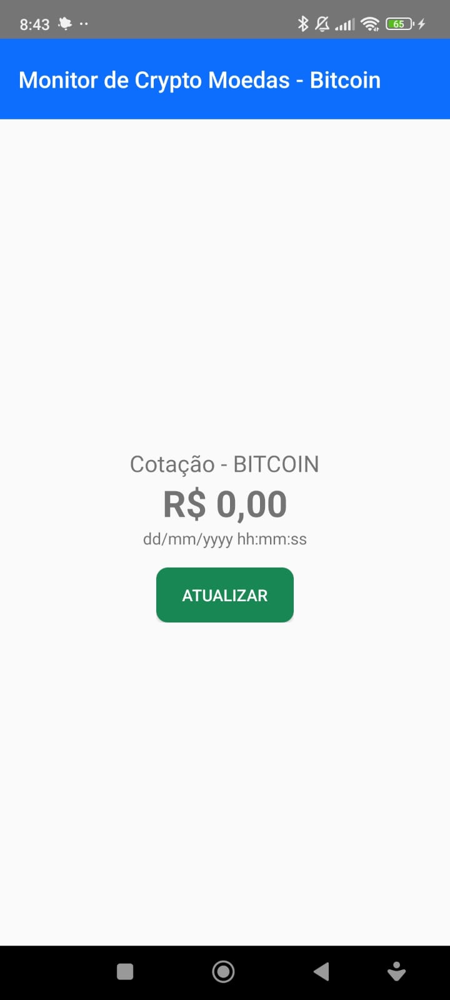
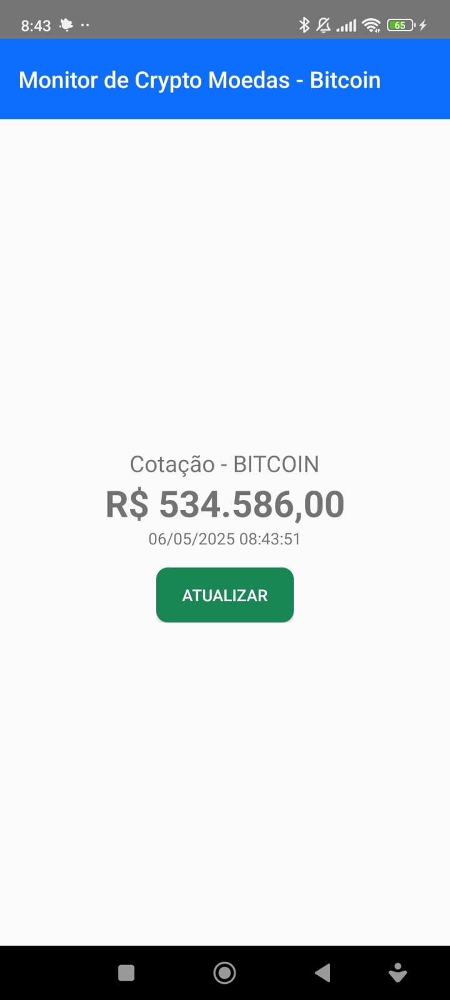

# 📱 Crypto Monitor

**Crypto Monitor** é um aplicativo Android desenvolvido em **Kotlin** que permite monitorar preços de criptomoedas em tempo real. O aplicativo consome dados de uma API pública e exibe as informações de forma dinâmica na interface do usuário.

## 🛠️ Tecnologias Utilizadas

- **Kotlin**: Linguagem de programação principal.
- **Android SDK**: Framework utilizado para desenvolver o app.
- **Retrofit**: Biblioteca para consumo da API.
- **Coroutines**: Para chamadas assíncronas.
- **ViewModel + LiveData**: Arquitetura recomendada para manipulação de dados.

## 📂 Estrutura do Projeto

```
crypto-monitor/
├── app/
│   ├── src/
│   │   ├── main/
│   │   │   ├── java/
│   │   │   │   └── com/
│   │   │   │       └── example/
│   │   │   │           └── cryptomonitor/
│   │   │   │               └── MainActivity.kt
│   │   │   └── res/
│   │   │       ├── layout/
│   │   │       │   ├── activity_main.xml
│   │   │       │   └── item_crypto.xml
│   │   │       └── values/
│   │   │           ├── colors.xml
│   │   │           ├── strings.xml
│   │   │           └── themes.xml
├── build.gradle.kts
├── settings.gradle.kts
└── README.md
```
## 🖼️ Captura de Tela




## 🧑‍💻 Código

### MainActivity.kt

A classe `MainActivity` é a principal `Activity` do aplicativo, responsável por inicializar a interface e gerenciar interações do usuário.

```kotlin
class MainActivity : AppCompatActivity() {
    override fun onCreate(savedInstanceState: Bundle?) {
        super.onCreate(savedInstanceState)
        setContentView(R.layout.activity_main)

        // Configurando a toolbar
        val toolbarMain: Toolbar = findViewById(R.id.toolbar_main)
        configureToolbar(toolbarMain)

        // Configurando o botão Refresh
        val btnRefresh: Button = findViewById(R.id.btn_refresh)
        btnRefresh.setOnClickListener {
            makeRestCall()
        }
    }
}
```

- **`onCreate(savedInstanceState)`**: Esta função é chamada quando a `Activity` é criada. Dentro dela, configuramos os elementos da interface.
- **`setContentView(R.layout.activity_main)`**: Define o layout da `Activity`.
- **Toolbar**: Criada para exibir uma barra de navegação no topo da tela.
- **Botão Refresh**: Ao ser clicado, executa a função `makeRestCall()` para buscar os dados atualizados.

### makeRestCall()

A função `makeRestCall()`:
Utiliza o Coroutine para realizar a chamada assincrona
Realiza a requisição HTTP para obter os dados de criptomoedas, atráves da MercadoBitcoinServiceFactory.
MercadoBitcoinServiceFactory usa a interface MercadoBitcoinService e está utiliza de retrofit para realizar a requisão HTTP.
Caso a resposta seja bem sucedida, vamos atualizar os componentes com as informações resgatadas na API
Caso não tenhamos sucesso na resposta, retorna o erro correspondente.

```kotlin
    private fun makeRestCall() {
    CoroutineScope(Dispatchers.Main).launch {
        try {
            val service = MercadoBitcoinServiceFactory().create()
            val response = service.getTicker()

            if (response.isSuccessful) {
                val tickerResponse = response.body()

                // Atualizando os componentes TextView
                val lblValue: TextView = findViewById(R.id.lbl_value)
                val lblDate: TextView = findViewById(R.id.lbl_date)

                val lastValue = tickerResponse?.ticker?.last?.toDoubleOrNull()
                if (lastValue != null) {
                    val numberFormat = NumberFormat.getCurrencyInstance(Locale("pt", "BR"))
                    lblValue.text = numberFormat.format(lastValue)
                }

                val date = tickerResponse?.ticker?.date?.let { Date(it * 1000L) }
                val sdf = SimpleDateFormat("dd/MM/yyyy HH:mm:ss", Locale.getDefault())
                lblDate.text = sdf.format(date)

            } else {
                // Trate o erro de resposta não bem-sucedida
                val errorMessage = when (response.code()) {
                    400 -> "Bad Request"
                    401 -> "Unauthorized"
                    403 -> "Forbidden"
                    404 -> "Not Found"
                    else -> "Unknown error"
                }
                Toast.makeText(this@MainActivity, errorMessage, Toast.LENGTH_LONG).show()
            }

        } catch (e: Exception) {
            // Trate o erro de falha na chamada
            Toast.makeText(this@MainActivity, "Falha na chamada: ${e.message}", Toast.LENGTH_LONG).show()
        }
    }
}
```
## Android Manifest
Para que a integração com a API ocorra de forma correta, precisamos permitir que o dispositivo acesse internet. Para fazer isso, devemos adicionar a seguinte linha de código no AndroidManifest:
`<uses-permission android:name="android.permission.INTERNET" />`


## 🖼️ Layouts XML

### activity_main.xml

Define a tela principal com:

- **Toolbar** no topo.
- **RecyclerView** para listar criptomoedas.
- **Botão Refresh** para atualizar os dados.

### item_crypto.xml

Layout de cada item da lista:

- Nome da criptomoeda.
- Preço da criptomoeda.

### colors.xml

Define cores usadas no app, como primária e secundária.
`   <color name="primary">#0d6efd</color>
    <color name="success">#198754</color>`

### strings.xml

Define strings utilizadas na interface, como nomes de botões e título do app.


### themes.xml

Define o tema visual do aplicativo (claro e escuro).

## 🚀 Como Executar

1. Clone o repositório:

```bash
git clone https://github.com/Henriquemosseri/crypto-monitor.git
```

2. Abra o projeto no Android Studio.

3. Execute em um dispositivo ou emulador Android.

## 📚 Objetivo do Projeto

Estudar a integração de APIs com Android usando Kotlin, boas práticas de arquitetura e componentes modernos como Retrofit, ViewModel e LiveData.
